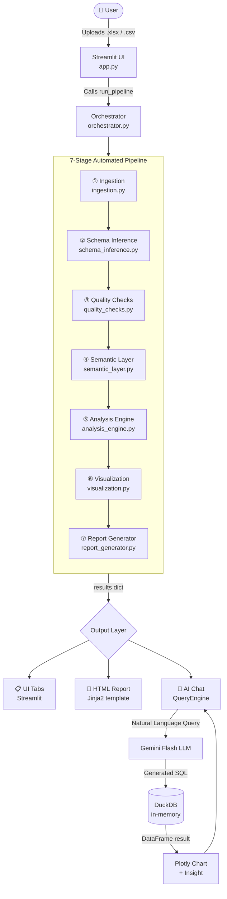
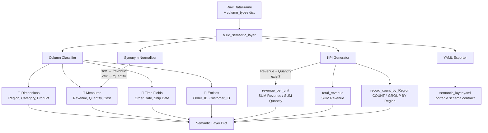
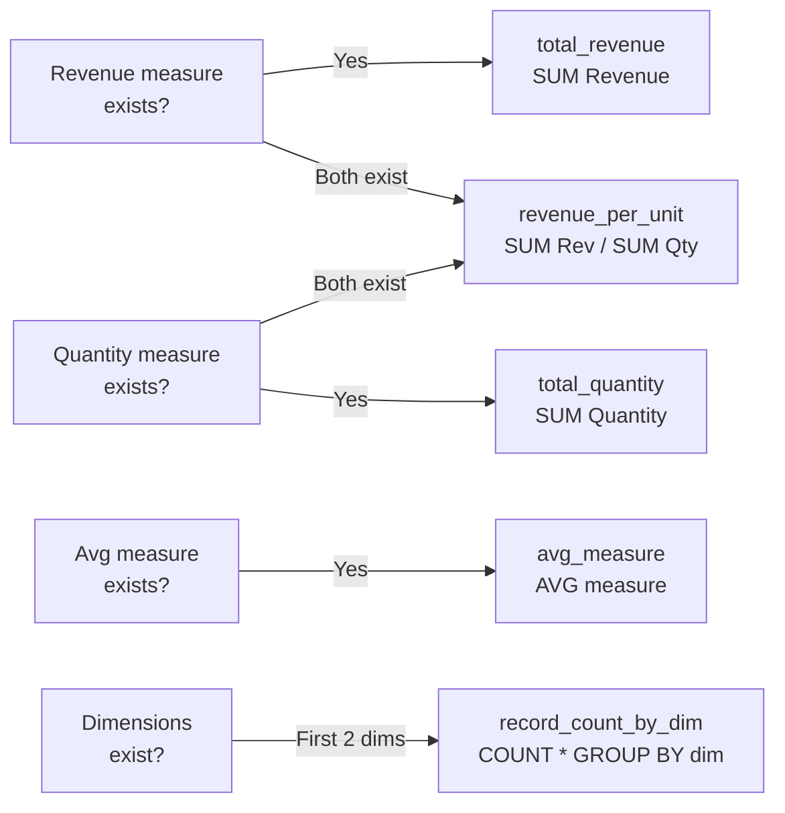
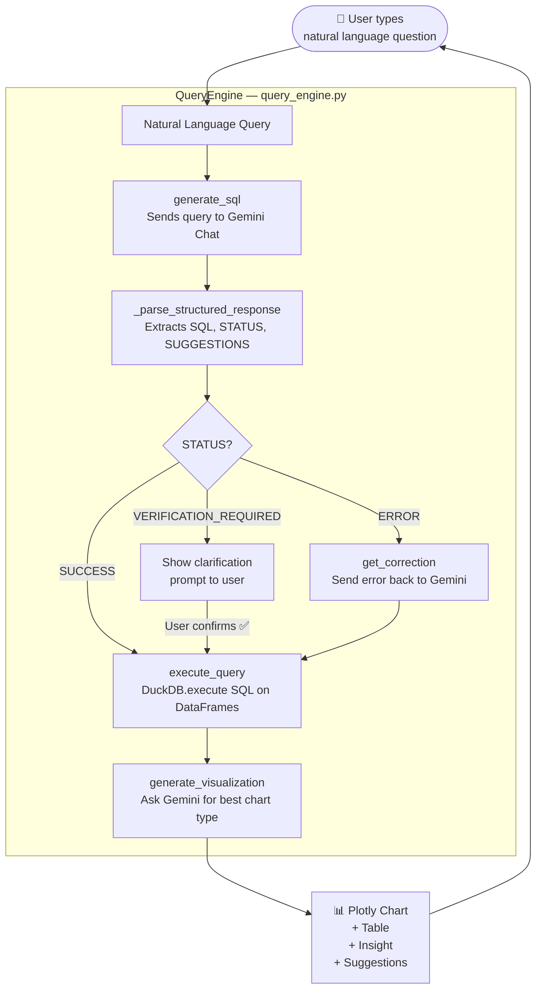
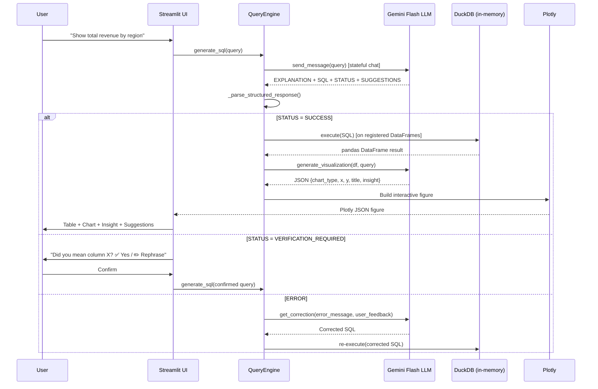
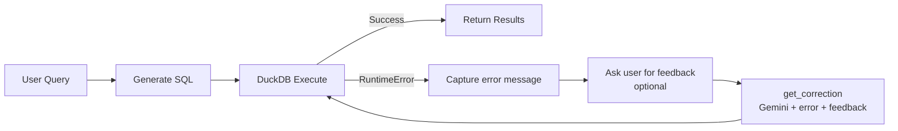

# 📊 Data Analysis Agent — Complete Workflow, Tech Stack & Architecture Guide

This document is the single-source reference that explains **how this project works end-to-end**: the system workflow, why each technology was chosen, how the Semantic Layer is constructed, and how the AI Assistant (Text-to-SQL) operates.

---

## Table of Contents

1. [System Workflow (End-to-End)](#1-system-workflow-end-to-end)
2. [Tech Stack & Why Those Choices](#2-tech-stack--why-those-choices)
3. [How the Semantic Layer Is Built](#3-how-the-semantic-layer-is-built)
4. [How the AI Assistant (Text-to-SQL) Works](#4-how-the-ai-assistant-text-to-sql-works)
5. [Configuration & Extensibility](#5-configuration--extensibility)

---

## 1. System Workflow (End-to-End)

The application executes a **7-stage automated pipeline**, orchestrated by `agent/orchestrator.py`, every time a file is uploaded.

### 1.1 High-Level Flow



### 1.2 Stage-by-Stage Detail

| # | Module | Input | What Happens | Output |
|---|--------|-------|-------------|--------|
| **① Ingestion** | `ingestion.py` | Raw file bytes | Detects best sheet (`_pick_best_sheet`), skips title rows (`_detect_header_row`), handles merged cells | Clean `pandas.DataFrame` |
| **② Schema Inference** | `schema_inference.py` | DataFrame | Samples up to 200 rows per column; classifies each as `numeric`, `categorical`, `datetime`, `boolean`, `identifier`, or `text` | `column_types` dict + data dictionary |
| **③ Quality Checks** | `quality_checks.py` | DataFrame + column_types | Calculates null %, flags duplicate rows, detects outliers via IQR & Z-score, checks mixed types | Quality score (0-100) + issue list |
| **④ Semantic Layer** | `semantic_layer.py` | DataFrame + column_types | Classifies columns into Dimensions/Measures/Time; maps synonyms; generates KPIs; exports YAML | Semantic layer dict + YAML contract |
| **⑤ Analysis Engine** | `analysis_engine.py` | DataFrame + semantic layer | Runs frequency analysis, descriptive stats, Pearson correlations, time-series trends; scores each insight | Prioritised insights list |
| **⑥ Visualization** | `visualization.py` | DataFrame + semantic layer | Auto-selects best Plotly chart per column combination (line, bar, scatter, heatmap, pie) | List of Plotly figure objects |
| **⑦ Report Generator** | `report_generator.py` | All above results | Feeds results into a Jinja2 HTML template; embeds Plotly JS inline | Self-contained `analysis_report.html` |

### 1.3 Streamlit UI Tabs

After the pipeline finishes, the results dictionary drives six tabs in the Streamlit interface:

```
┌──────────────────────────────────────────────────────────────────┐
│  📋 Data Quality  │  🗂 Schema  │  🧠 Semantic  │  📈 Insights  │
│  📊 Charts        │  📄 Report  │  🤖 AI Chat (Query Engine)     │
└──────────────────────────────────────────────────────────────────┘
```

| Tab | Contents |
|-----|----------|
| 📋 Data Quality | Per-column null %, outlier count, duplicate rows, quality score (0-100) |
| 🗂 Schema | Data dictionary with inferred types, sample values, notes |
| 🧠 Semantic Layer | Dimensions, measures, time fields, KPIs, YAML export button |
| 📈 Analysis & Insights | Prioritised business insights with confidence scores & severity colours |
| 📊 Charts | All interactive Plotly charts with zoom/pan/export |
| 📄 Download Report | One-click HTML report download + inline preview |
| 🤖 AI Chat | Natural language → SQL → results + chart + smart follow-up suggestions |

---

## 2. Tech Stack & Why Those Choices

Every library in this project was chosen deliberately. The guiding principles were: **zero infrastructure dependencies** (runs locally without Docker, cloud services, or databases), **production-grade correctness**, and **minimal footprint**.

### 2.1 Core Language

| Technology | Version | Why It Was Chosen |
|------------|---------|-------------------|
| **Python** | 3.12+ | Dominant language for data science with the richest ecosystem. Type hints (3.10+) improve IDE support and maintainability. |

### 2.2 Data Processing

| Library | Why It Was Chosen | Alternative Considered |
|---------|-------------------|----------------------|
| **pandas** | Industry-standard DataFrame library. Handles heterogeneous column types, missing data, and groupby operations with a mature, well-tested API. | Polars (faster, but less ecosystem compatibility for Excel/report generation) |
| **numpy** | Required by pandas; also provides fast vectorised operations for statistical calculations (skewness, kurtosis, percentiles). | Built-in `statistics` module (too slow, no array operations) |
| **scipy** | Provides peer-reviewed statistical functions: IQR-based outlier detection, Pearson correlations, skewness/kurtosis — all used in `quality_checks.py` and `analysis_engine.py`. | `statsmodels` (heavier install, more complex API for simple stats) |
| **openpyxl** | Reads modern `.xlsx` (OOXML) format including merged cells, multiple sheets, and formatted cells. | `xlwings` (requires Excel installation, not cross-platform) |
| **xlrd** | Reads legacy `.xls` (BIFF8) binary format. openpyxl cannot read `.xls`. | N/A (only library that handles `.xls` cleanly) |
| **python-dateutil** | Robust date parser that handles ambiguous formats (e.g., `01/02/03`, `Feb-24`, ISO 8601) that `pandas.to_datetime` fails on. | `dateparser` (heavier, slower) |
| **chardet** | Auto-detects encoding of CSV files (UTF-8, Latin-1, CP1252, etc.) to prevent UnicodeDecodeError on real-world files. | Manual encoding guessing (error-prone) |

### 2.3 Visualization

| Library | Why It Was Chosen | Alternative Considered |
|---------|-------------------|----------------------|
| **Plotly** | Generates **interactive** HTML/JS charts that can be embedded directly in the standalone HTML report without a server. Supports 30+ chart types. | Matplotlib (static images only — cannot be embedded interactively in HTML) |
| **Kaleido** | Server-side static image renderer for Plotly figures, used when exporting charts to PDF or when embedding in email reports. | `orca` (deprecated, requires Electron) |

### 2.4 Frontend

| Library | Why It Was Chosen | Alternative Considered |
|---------|-------------------|----------------------|
| **Streamlit** | Converts plain Python code into a production web app in minutes with zero HTML/CSS/JS knowledge required. Multi-tab layout, file uploader, chat interface, and sidebar settings all provided out of the box. | Flask + React (100× more code, requires frontend expertise) |

### 2.5 Query Execution (AI Chat)

| Library | Why It Was Chosen | Alternative Considered |
|---------|-------------------|----------------------|
| **DuckDB** | In-process SQL engine that can query **pandas DataFrames directly** via `con.register()` — no import/export step. ANSI SQL compliant, runs entirely in memory, and handles gigabyte-scale data efficiently. | SQLite (must serialise to disk; no native DataFrame support); Spark (heavyweight, cluster dependency) |
| **Google Generative AI (Gemini)** | State-of-the-art LLM with a free Flash tier suitable for NL→SQL and chart type recommendation. Supports **stateful multi-turn chat** (`model.start_chat()`), which is essential for maintaining schema context across questions. | OpenAI GPT-4o (higher cost at scale); local models (insufficient NL→SQL accuracy without fine-tuning) |

### 2.6 Configuration & Reporting

| Library | Why It Was Chosen | Alternative Considered |
|---------|-------------------|----------------------|
| **PyYAML** | Human-readable config format for `config.yaml` and for exporting the Semantic Layer as a portable YAML "contract". | JSON (less readable for non-developers); TOML (less common in data tooling) |
| **Jinja2** | Powerful HTML templating engine that allows embedding Python objects (charts, tables, insights) into a static HTML template. Creates **fully self-contained** reports with no external CSS/JS dependencies. | Mako, Chameleon (less widely known), f-strings (cannot handle complex loops/conditionals) |

### 2.7 Testing

| Library | Why It Was Chosen |
|---------|-------------------|
| **pytest** | De-facto standard Python test framework. Rich plugin ecosystem, parametrised tests, and excellent failure output. |
| **pytest-cov** | Measures code coverage to ensure all pipeline modules are tested. |

---

## 3. How the Semantic Layer Is Built

The Semantic Layer is a **dbt-inspired metadata abstraction** built by `agent/semantic_layer.py`. It bridges raw, messy column names and the higher-level business concepts required for accurate analysis and AI-powered querying.

### 3.1 Architecture



### 3.2 Step-by-Step: Column Classification

The `build_semantic_layer()` function iterates over every column that passed schema inference and assigns it a **semantic type** based on the type inferred in Stage ②:

```
column_type   →   semantic_type
──────────────────────────────────
"datetime"    →   Time Field      (granularities: day/month/quarter/year)
"identifier"  →   Entity          (unique IDs, PKs)
"numeric"     →   Measure         (aggregation + format inferred from name)
"categorical" →   Dimension       (sample values capped at 50)
"boolean"     →   Dimension       (True/False grouping)
"text"        →   Dimension       (free-text, groupable)
```

### 3.3 Aggregation Inference

For **Measure** columns, the default aggregation is inferred from the column name using three keyword lists defined in the module:

| Aggregation | Triggers When Column Name Contains… | Example Columns |
|-------------|--------------------------------------|-----------------|
| `SUM` (default) | `amount`, `revenue`, `sales`, `profit`, `cost`, `price`, `quantity`, `total` | `total_revenue`, `sales_amount` |
| `AVG` | `rate`, `ratio`, `average`, `score`, `percent`, `pct`, `satisfaction`, `rating`, `age` | `customer_rating`, `discount_pct` |
| `COUNT` | `count`, `cnt`, `num`, `number`, `id` | `order_count`, `num_items` |

### 3.4 Synonym Normalisation

Column names in real-world data are inconsistent (`sls_rev`, `Rev_Usd`, `sales income`). The semantic layer applies a **synonym lookup** (loaded from `config.yaml`) to map raw names to canonical business terms:

```yaml
# config.yaml
semantic_layer:
  synonym_mapping:
    revenue:  ["rev", "sales", "income", "earnings"]
    quantity: ["qty", "count", "cnt", "num"]
    amount:   ["amt", "value", "val", "sum"]
    customer: ["client", "cust", "buyer", "account"]
    region:   ["area", "zone", "territory", "geo"]
```

**Algorithm:**
1. Full-match check: is the entire lowercased column name a synonym key?
2. Partial-match check: does any synonym keyword appear as a substring?
3. If no match: convert to `snake_case` and use as-is.

### 3.5 Auto-KPI Generation

The `_generate_kpis()` function automatically creates derived metrics when it detects specific measure combinations:



### 3.6 YAML Export (Portable Schema Contract)

After classification, the full semantic layer is serialised to a YAML string and optionally written to disk. This file acts as a **schema-as-code contract**:

```yaml
semantic_layer:
  version: "1.0"
  dimensions:
    - raw_column: Region
      semantic_name: region
      description: "Categorical dimension: Region"
      semantic_type: dimension
      values: [East, North, South, West]
  measures:
    - raw_column: Revenue
      semantic_name: revenue
      description: "Numeric measure: Revenue"
      semantic_type: measure
      aggregation: sum
      format: currency
  time_fields:
    - raw_column: Order_Date
      semantic_name: order_date
      semantic_type: time
      granularities: [day, month, quarter, year]
  kpis:
    - name: total_revenue
      formula: "SUM(Revenue)"
      description: "Total Revenue across all records"
      format: currency
    - name: revenue_per_unit
      formula: "SUM(Revenue) / SUM(Quantity)"
      description: "Average revenue generated per unit sold"
      format: currency
```

This YAML serves as a portable reference contract that can be adapted for downstream tools (dbt models, Metabase metadata, Cube.dev schema files), ensuring every team works from the **same business definitions**.

---

## 4. How the AI Assistant (Text-to-SQL) Works

The AI Query Engine (`agent/query_engine.py`) converts plain English questions into SQL, executes them on the loaded DataFrames, and automatically generates a relevant chart.

### 4.1 Architecture



### 4.2 Session Initialisation (`start_chat`)

Before any question is answered, `QueryEngine.start_chat(results_dict)` is called once. This:

1. **Builds a schema context string** from the Semantic Layer of every uploaded table:
   - Lists all Dimension columns with sample values
   - Lists all Measure columns with their default aggregation
   - Lists all Time Field columns
   - Lists all pre-calculated KPIs and their formulas

2. **Creates a stateful chat session** (`model.start_chat()`) and sends a system-instruction preamble:

```
SYSTEM INSTRUCTIONS:
You are an expert Data Analyst and SQL Engineer.
Your goal is to translate natural language into SQL for these tables: [sales, orders, …]

SCHEMA CONTEXT:
TABLE: 'sales'
Dimensions (Categories):
- Region: Categorical dimension. Examples: [East, North, South]
- Category: Categorical dimension. Examples: [Electronics, Furniture]
Measures (Numbers):
- Revenue: Numeric measure (Default agg: sum)
- Quantity: Numeric measure (Default agg: sum)
Time Fields:
- Order_Date: Time field
Calculated KPIs:
- total_revenue: Total Revenue across all records (Formula: SUM(Revenue))
- revenue_per_unit: Average revenue per unit (Formula: SUM(Revenue)/SUM(Quantity))

CRITICAL RULES:
1. Use ONLY the exact 'raw_column' names listed above.
2. If unsure about column mapping → STATUS: VERIFICATION_REQUIRED
3. After every successful query → provide 2-3 SMART_SUGGESTIONS
4. Use DuckDB-compatible SQL.
5. Respond in this exact format:
   EXPLANATION: ...
   SQL: ```sql ... ```
   STATUS: SUCCESS | VERIFICATION_REQUIRED
   CORRECTION_PROMPT: ...
   SUGGESTIONS: ...
```

Because Gemini's `start_chat()` maintains **conversation history**, every follow-up question has access to prior context — enabling multi-turn conversations like refinements ("now filter by North region only").

### 4.3 Query Flow: Step by Step



### 4.4 Response Parsing (`_parse_structured_response`)

Gemini returns a structured text block. The parser uses **regex extraction** to pull out each section:

```python
# Extract SQL (supports both markdown blocks and raw SELECT statements)
sql = re.search(r"```sql\s*(.*?)\s*```", text, re.DOTALL)       # markdown
   or re.search(r"(SELECT|WITH)\s+.*?;?", text, re.DOTALL)      # raw

# Extract STATUS
status = re.search(r"STATUS:\s*(VERIFICATION_REQUIRED|SUCCESS)", text)

# Extract CORRECTION_PROMPT (used for clarification dialogs)
cp = re.search(r"CORRECTION_PROMPT:\s*(.*)", text)

# Extract SUGGESTIONS (split on newlines, strip bullet markers)
sug = re.search(r"SUGGESTIONS:\s*(.*)", text, re.DOTALL)
```

### 4.5 SQL Execution via DuckDB

DuckDB is ideal here because it can **directly query in-memory pandas DataFrames** without a database server:

```python
# Register each uploaded DataFrame as a virtual table
for table_name, result in results_dict.items():
    self.con.register(table_name, result["dataframe"])

# Execute the generated SQL
result_df = self.con.execute(generated_sql).df()
```

This means multi-table JOINs work naturally:
```sql
-- Generated for "Show top customers by revenue"
SELECT c.Customer_Name, SUM(s.Revenue) AS total_revenue
FROM sales s
JOIN customers c ON s.Customer_ID = c.Customer_ID
GROUP BY c.Customer_Name
ORDER BY total_revenue DESC
LIMIT 10;
```

### 4.6 Visualization Recommendation

After the query executes, a second Gemini call (stateless) asks for the best chart type:

```
Prompt → Query context + column names + first 3 rows of result
Response → JSON { chart_type, x, y, title, insight }
```

| Chart type selected when… | Example |
|--------------------------|---------|
| `bar` | Categorical X, numeric Y, ≤ 50 rows | Revenue by Region |
| `line` | Time X, numeric Y | Monthly Revenue Trend |
| `scatter` | Two numeric columns | Price vs. Quantity |
| `pie` | Categorical X, % share | Market Share by Category |
| `table` | Many columns or fallback | Raw query result |

If Gemini's suggestion cannot be parsed (network error, malformed JSON), a **heuristic fallback** fires: first column → X axis, second column → Y axis, rendered as a bar chart.

### 4.7 Error Recovery Loop



### 4.8 Multi-Turn Chat & Suggestions

Every successful response includes 2–3 **SMART_SUGGESTIONS** — contextual follow-up questions that the user can click to auto-fill the input box:

```
First query:  "Show total revenue by region"
Suggestions:  1. "Which region had the highest revenue growth last quarter?"
              2. "Break down revenue by category within each region"
              3. "Show the top 5 products by revenue in the North region"
```

The Streamlit session state (`st.session_state`) stores the full conversation history, allowing the user to scroll back through all queries and results in the current session.

---

## 5. Configuration & Extensibility

All pipeline thresholds are exposed in `config.yaml` so the agent can be tuned for different domains without code changes:

```yaml
schema_inference:
  datetime_threshold: 0.85        # Raise to 0.95 for stricter date detection
  numeric_threshold: 0.90

quality_checks:
  outlier_iqr_multiplier: 1.5     # 2.0 for looser outlier flagging
  high_null_threshold: 0.50       # Flag if >50% nulls

semantic_layer:
  synonym_mapping:
    revenue: ["rev", "sales"]     # Add company-specific abbreviations
    customer: ["client", "acct"]

visualization:
  max_charts: 30
  max_scatter_points: 5000
```

### Extending the Pipeline

Each stage is a **pure function** (or simple class) that takes a DataFrame and returns a dict. To add a new stage:

1. Create `agent/my_new_module.py` with a function `run_my_stage(df, config) -> dict`.
2. Call it in `agent/orchestrator.py` after the relevant existing stage.
3. Add its output key to the results dict that flows into the report and UI tabs.

The modular design means individual modules can be replaced (e.g., swap Gemini for a different LLM by changing `query_engine.py`'s constructor) without touching the rest of the pipeline.

---

*For a quick-start guide, see [README.md](README.md). For a business-facing overview, see [Manager_Pitch_Document.md](Manager_Pitch_Document.md). For a non-technical semantic layer explanation, see [Semantic_Layer__Guide.md](Semantic_Layer__Guide.md).*
